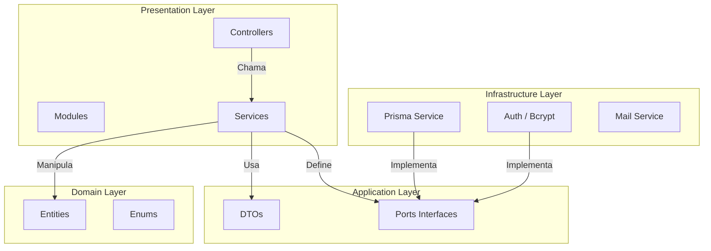
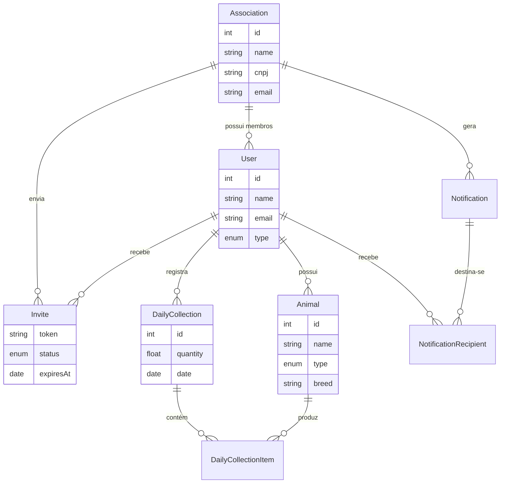

# QuaLeiDer - Backend API

> Sistema de gestão para produtores de leite, coletas diárias e associações rurais.

[](https://github.com/marcelo-ifpe/qualeider/actions/workflows/tests.yml)
[](https://nestjs.com/)
[](https://www.typescriptlang.org/)
[](https://www.prisma.io/)
[](https://www.postgresql.org/)
[](https://jwt.io/)
[](https://www.docker.com/)

## Índice

- [Sobre](#-sobre)
- [Arquitetura](#-arquitetura)
- [Começo Rápido](#-começo-rápido)
- [Funcionalidades](#-funcionalidades)
- [API Endpoints](#-api-endpoints)
- [Banco de Dados](#-banco-de-dados)
- [Instalação Detalhada](#-instalação-detalhada)
- [Resolução de Problemas](#%EF%B8%8F-resolução-de-problemas)
- [Testes](#-testes)

## 📌 Sobre

QuaLeiDer é uma plataforma desenvolvida para o **Instituto Federal de Pernambuco (IFPE)** para modernizar a gestão da produção leiteira. O sistema conecta pequenos produtores a associações, permitindo registro digital de coletas, controle de rebanho e transparência na produção.

## 🏗️ Arquitetura

O backend segue **Clean Architecture** com separação estrita de responsabilidades.



### Stack & Tecnologias
- **Core**: Node.js 20, NestJS 10, TypeScript 5
- **Dados**: PostgreSQL 14, Prisma 6 (ORM)
- **Segurança**: JWT, Bcrypt, Helmet, Class-Validator
- **Infra**: Docker, Github Actions (CI)

## 🚀 Começo Rápido

Para rodar todo o ambiente (Banco + API) com um único comando (requer Docker):

```bash
# Na raiz do workspace (onde está o docker-compose.yml)
docker-compose up --build
```

A API estará disponível em: `http://localhost:8080`

Para parar:
```bash
docker-compose down
```

## ✨ Funcionalidades

| Funcionalidade | Status | Descrição |
| :--- | :---: | :--- |
| **Gestão de Coletas** | ✅ | Registro diário de litragem, gordura e itens do tanque |
| **Controle de Rebanho** | ✅ | Cadastro de vacas, cabras, ovelhas com dados genealógicos |
| **Associações** | ✅ | Gestão de múltiplos produtores e áreas de cobertura |
| **Convites** | ✅ | Sistema de tokens por email para novos membros |
| **Notificações** | ✅ | Avisos internos para produtores |
| **Relatórios** | 🚧 | Geração de PDFs e exportação de dados (Em progresso) |
| **Dashboard** | 📅 | Gráficos analíticos avançados (Planejado) |

## 📡 API Endpoints

Documentação interativa completa disponível via Swagger em: `http://localhost:8080/api`

### Exemplo de Uso: Registrar Coleta

<details>
<summary><b>POST /daily-collections</b> (Clique para expandir)</summary>

**Payload:**

```json
{
  "quantity": 150.5,
  "collectionDate": "2023-10-27T08:00:00Z",
  "numAnimals": 10,
  "numOrdens": 2,
  "rationProvided": true,
  "numLactation": 5,
  "milkingPlace": "Curral",
  "technicalAssistance": false,
  "items": [
    {
       "animalId": 1,
       "quantity": 15.5
    }
  ]
}
```

**Response (201 Created):**

```json
{
  "id": 123,
  "quantity": 150.5,
  "userId": 45,
  "createdAt": "2023-10-27T08:00:01Z",
  "items": [
    { "id": 1, "quantity": 15.5, "animalId": 1 }
  ]
}
```

</details>

## 🗄️ Banco de Dados

Diagrama Entidade-Relacionamento do sistema:



## 🔧 Instalação Detalhada

Se preferir rodar localmente sem Docker (apenas para o banco):

1. **Clone e Instale:**
   ```bash
   git clone https://github.com/marcelo-ifpe/qualeider.git
   cd qualeider/backend
   npm install
   ```

2. **Configure o `.env`:**
   ```bash
   cp .env.example .env
   # Edite as variáveis DATABASE_URL, JWT_SECRET, etc.
   ```

3. **Banco de Dados:**
   ```bash
   # Inicie seu Postgres local ou use docker só para o banco
   docker-compose up -d postgres
   
   # Rode as migrations
   npx prisma migrate dev
   ```

4. **Execute:**
   ```bash
   npm run start:dev
   ```

## ⚠️ Resolução de Problemas

**Erro: Porta 5432 já em uso**
Se você tiver um Postgres local rodando, o Docker falhará.
Pare o serviço local: `sudo service postgresql stop` ou altere a porta no `docker-compose.yml`.

**Erro: Prisma Client not initialized**
Se o container subir antes das migrations ou após mudanças no schema:
```bash
npx prisma generate
```

**Erro: Conexão recusada no Docker**
Certifique-se de que a `DATABASE_URL` no `.env` aponta para `host.docker.internal` ou o nome do serviço (`postgres`) dependendo de onde você está rodando (host vs container).

## 🧪 Testes

O projeto possui cobertura de testes unitários e E2E.

```bash
# Unitários
npm run test

# Cobertura (>80%)
npm run test:cov

# End-to-End
npm run test:e2e
```

---
**Desenvolvido como parte do IFPE.**
⭐ Se este projeto foi útil, considere dar uma estrela!
