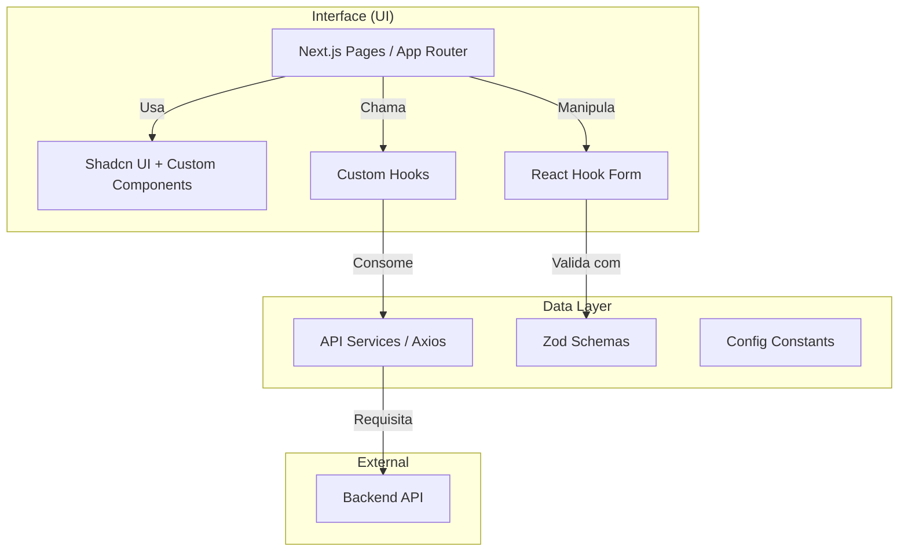

# QuaLeiDer - Frontend Client

> Cliente web moderno para gestão da produção leiteira e associações rurais.

[](https://nextjs.org/)
[](https://react.dev/)
[](https://tailwindcss.com/)
[](https://www.radix-ui.com/)
[](https://www.typescriptlang.org/)

## Índice

- [Sobre](#-sobre)
- [Arquitetura e Fluxo](#-arquitetura-e-fluxo)
- [Começo Rápido](#-começo-rápido)
- [Funcionalidades](#-funcionalidades)
- [Tecnologias](#%EF%B8%8F-tecnologias)
- [Configuração Detalhada](#%EF%B8%8F-configuração-detalhada)
- [Estrutura do Projeto](#%EF%B8%8F-estrutura-do-projeto)
- [Contribuição](#-contribuição)

## 📌 Sobre

A interface web do **QuaLeiDer** foi projetada para ser intuitiva para produtores rurais e administradores de associações. Ela consome a API REST do backend para fornecer dashboards em tempo real, gestão de formulários complexos e visualização de dados.

## 🏗️ Arquitetura e Fluxo

O frontend segue uma arquitetura baseada em features com componentes modulares e serviços tipados.



## 🚀 Começo Rápido

Para rodar o frontend em modo de desenvolvimento:

```bash
# 1. Entre na pasta
cd frontend

# 2. Instale dependências
npm install

# 3. Configure variáveis (Use defaults)
cp .env.example .env.local

# 4. Inicie
npm run dev

```

Acesse: `http://localhost:3001`

> **Nota**: Certifique-se que o Backend esteja rodando em `localhost:8080`.

## ✨ Funcionalidades

| Componente UI | Status | Descrição |
| --- | --- | --- |
| **Painel do Produtor** | ✅ | Visão geral de coletas recentes e estatísticas rápidas |
| **Formulário de Coletas** | ✅ | Entrada de dados com validação em tempo real e wizards |
| **Gestão de Animais** | ✅ | Cartões interativos para visualizar e editar rebanho |
| **Portal da Associação** | ✅ | Tabelas avançadas para gestão de membros e convites |
| **Sistema de Convites** | ✅ | Interface para gerenciar tokens de novos membros |
| **Gráficos** | 🚧 | Visualização visual da evolução da produção (Recharts) |
| **Responsividade** | ✅ | Totalmente adaptado para Mobile e Desktop |

## 🛠️ Tecnologias

* **Framework**: [Next.js 15](https://nextjs.org/) (App Router)
* **Core**: React 19, TypeScript
* **Estilo**: Tailwind CSS + `tailwindcss-animate`
* **Componentes**: Radix UI (base para Shadcn/ui), Lucide Icons
* **Estado/Dados**: React Hooks, Axios, SWR (em breve)
* **Formulários**: React Hook Form + Zod (Validação Schema-first)
* **Utilitários**: `date-fns` (datas), `clsx` (classes condicionais)

## ⚙️ Configuração Detalhada

### Variáveis de Ambiente (`.env.local`)

| Variável | Descrição | Padrão |
| --- | --- | --- |
| `NEXT_PUBLIC_API_URL` | Endpoint base da API REST | `http://localhost:8080` |

### Scripts Disponíveis

```bash
npm run dev      # Servidor de desenvolvimento
npm run build    # Build de produção
npm run start    # Servidor de produção
npm run lint     # Checagem de código (ESLint)

```

## 📂 Estrutura do Projeto

```plaintext
frontend/
├── src/
│   ├── app/                # Rotas (App Router)
│   │   ├── (auth)/         # Rotas públicas (Login/Register)
│   │   ├── (dashboard)/    # Rotas protegidas (App principal)
│   │   ├── layout.tsx      # Layout base
│   │   └── page.tsx        # Landing page
│   │
│   ├── components/         # Biblioteca de componentes UI
│   │   ├── ui/             # Componentes base (Buttons, Inpus, Cards)
│   │   └── ...             # Componentes compostos
│   │
│   ├── services/           # Integração API (Pattern Facade)
│   │   ├── authService.ts
│   │   ├── animalService.ts
│   │   └── ...
│   │
│   ├── schemas/            # Schemas de validação Zod
│   ├── hooks/              # Hooks customizados (useAuth, etc)
│   ├── lib/                # Configurações globais (axios instance)
│   └── interfaces/         # Tipagem TypeScript
│
└── public/                 # Assets estáticos

```

## ⚠️ Resolução de Problemas

**Erro: Conexão recusada ao logar**
Verifique se o backend está rodando e se `NEXT_PUBLIC_API_URL` está apontando para a porta correta (padrão 8080).

**Erro: Hydration Mismatch**
Geralmente ocorre por extensões de browser ou datas mal formatadas. Tente limpar o cache ou verificar se o servidor e cliente estão no mesmo fuso horário.

## 🤝 Contribuição

1. Fork o projeto
2. Crie uma branch (`git checkout -b feature/AmazingFeature`)
3. Commit (`git commit -m 'Add some AmazingFeature'`)
4. Push (`git push origin feature/AmazingFeature`)
5. Abra um Pull Request

---

**Desenvolvido como parte do IFPE.**
⭐ Se gostar, deixe sua estrela no repositório!
